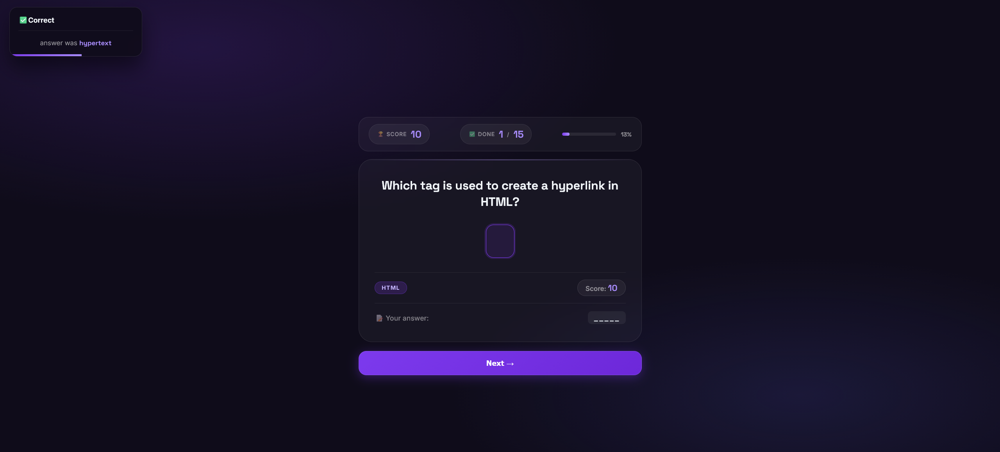

# 🎯 Quiz Game

A modern and interactive quiz application built with **HTML5**, **CSS3**, and **Vanilla JavaScript**.

Designed with a clean glassmorphism-inspired UI, animated feedback system, real-time score tracking, and OTP-style answer inputs.

---

## 📸 Preview



---

## ✨ Features

- 🎮 Interactive quiz experience
- ⚡ Real-time answer validation
- 🏆 Dynamic score system
- 📊 Progress tracking
- 🔔 Animated toast notifications
- ⌨️ OTP-style answer inputs
- 🚀 Built with pure JavaScript (No Frameworks)

---

## 🛠️ Technologies Used

| Technology        | Purpose              |
| ----------------- | -------------------- |
| HTML5             | Structure            |
| CSS3              | Styling              |
| Flexbox           | Layout               |
| JavaScript (ES6+) | Logic & Interactions |

---

## 📂 Project Structure

```text
Quiz-Game/
│
├── index.html
├── README.md
│
├── styles/
│   └── app.css
│
├── script/
│   ├── app.js
│   └── questions.json
│
└── preview.png
```

---

## 🚀 Getting Started

### Clone Repository

```bash
git clone https://github.com/your-username/quiz-game.git
```

### Enter Project Folder

```bash
cd quiz-game
```

### Run Project

Simply open:

```text
index.html
```

in your browser.

---

## 🤝 Contributing

Contributions, issues, and feature requests are welcome.

Feel free to fork the project and submit a pull request.

---

### Made with 🩵
